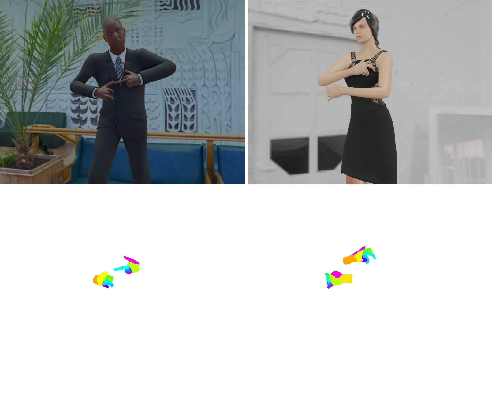

# Synthetic Human Dataset Generator

This is the official repository of the paper "A novel Framework for the Generation of Synthetic Datasets with Applications to Hand Detection and Segmentation". It contains the configurable framework and explanations on how to use it.

     
    Examples of generated images and their respective annotation.

## List of Content
| Folder | Description |
|------|------|
| DemoGenerator/						| A demo generator that can also be used as a template. It shows the capabilities of our framework. |
| HandPostureGenerator/					| Complete Blender files used to generate our hand gesture dataset.|
| VideoTutorial/					| Video tutorials on how to use the framework. |

## How to cite